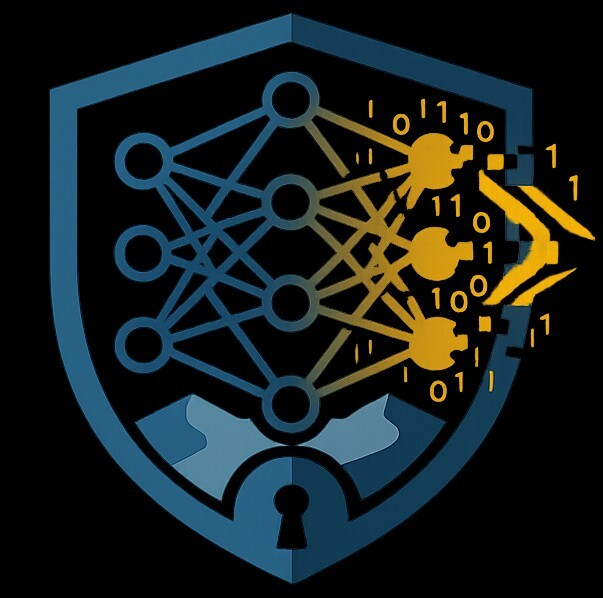

<div align="center">
<br/>
<h1>SarabCraft</h1>
<sub><em>AI Security Framework</em></sub><br/><br/>
Crafting Illusions Machines Believe.
</div>

[](https://www.python.org/downloads/)
[](https://opensource.org/licenses/MIT)
[](https://www.blackhat.com/arsenal.html)

**SarabCraft is a multimodal adversarial AI research framework for crafting believable image, text, and audio attacks, validating transfer across real targets, and turning the results into evidence security teams can act on.**

[Quick Start](#quick-start) · [Attacks](#supported-attacks) · [Verification](#transfer-verification) · [Model Management](#model-management) · [Workflows](#typical-workflows) · [Plugins](#plugin-system)

<br/>

**Demonstrating adversarial image attacks in the SarabCraft UI.**


<br/>

**Demonstrating adversarial text attacks in the SarabCraft UI.**


</div>

---

## What It Does

SarabCraft gives red teams, defenders, and researchers a single platform to demonstrate, measure, and communicate adversarial failure across image, text, and audio systems.

- **Recreate realistic failure cases** across image models, audio models, language models, and speech systems with 32+ image attacks, 14 text attacks, and 8 audio attack types
- **Measure more than a label flip** with perturbation metrics, GradCAM overlays, confidence shifts, side-by-side outputs, and transfer results
- **Prove transfer risk across real targets** including cloud APIs, local models, and custom plugins rather than stopping at a single lab checkpoint
- **Bring custom models and targets into the workflow** from the UI so teams can test the systems they actually care about
- **Scale from one sample to full studies** with batch runs, robustness sweeps, benchmark campaigns, jobs, artifacts, and history
- **Export evidence that travels well** in demos, briefings, write-ups, and disclosures through HTML reports and structured JSON

---

## Why Security Teams Care

- **For red teams** — turn abstract model risk into concrete demonstrations that engineers and leadership cannot dismiss
- **For defenders** — see which attacks transfer, which models break first, and where robustness claims fail under pressure
- **For researchers** — move from isolated proofs of concept to repeatable experiments across local and remote targets
- **For conference and client work** — produce outputs, artifacts, dashboards, and reports that are ready for demos, briefings, and reviews

---

## Quick Start

### Docker

```bash
git clone https://github.com/maerifat/SarabCraft.git
cd SarabCraft
cp .env.example .env
# Edit .env with local credentials for Postgres and MinIO
docker compose up --build -d
```

Open **http://localhost:7860**

For the full product experience, use the Docker flow above.

### Local

```bash
pip install -r requirements.txt
uvicorn backend.main:app --reload --port 8000

# In another terminal, from the repo root:
cd frontend && npm install && npm run dev
```

Frontend at http://localhost:5173, API at http://localhost:8000

Use Docker when you want the full analyst workflow, including long-running jobs, resumable runs, artifact persistence, centralized model management, and the integrated Jobs view.

### Recommended First Steps

1. Open **Settings > Models** to add custom local image, audio, or ASR models and any remote verification targets you want to test.
2. Open **Settings > Credentials** to configure provider profiles for Hugging Face, AWS, Azure, GCP, ElevenLabs, and other supported services.
3. Run **Image Attack**, **Text Attack**, or **Audio Attack** on a single sample, then verify transfer against local or remote targets.
4. Use **Jobs** for long-running attacks, robustness comparisons, and benchmark runs.
5. Review **Dashboard** and **History**, then export HTML or JSON evidence when you are ready to share results.

---

## Supported Attacks

### Image (32+ methods)

| Category | Method | Description |
|---|---|---|
| **Gradient (L∞)** | FGSM | Single-step gradient sign perturbation. Fastest but weakest attack. |
| | I-FGSM | Iterative FGSM with small steps. Stronger than single-step FGSM. |
| | PGD | Projected Gradient Descent with random start. Standard strong white-box baseline. |
| | APGD | Auto-PGD: adaptive step-size schedule + DLR loss. Parameter-free, strictly stronger. |
| | MI-FGSM | Momentum Iterative FGSM. Accumulates gradient momentum for better transferability. |
| | DI-FGSM | Diverse Input FGSM. Random resize-pad transform at each step improves transfer. |
| | TI-FGSM | Translation-Invariant FGSM. Gaussian kernel smooths gradients for shift invariance. |
| | NI-FGSM | Nesterov Iterative FGSM. Computes gradient at lookahead position for faster convergence. |
| | SI-NI-FGSM | Scale-Invariant Nesterov FGSM. Averages gradients at multiple image scales. |
| | VMI-FGSM | Variance-Tuned MI-FGSM. Adds neighbourhood gradient variance to reduce overfitting. |
| | VNI-FGSM | Variance-tuned Nesterov FGSM. Combines VMI variance with Nesterov lookahead momentum. |
| | PI-FGSM | Patch-wise Iterative FGSM. Amplifies perturbation through project kernel for targeted transfer. |
| | Jitter | PGD with random neighbourhood sampling before each gradient step. Escapes sharp local minima. |
| **Optimization** | DeepFool (L2) | Finds minimal perturbation to cross the decision boundary. Iterative linearisation. |
| | C&W (L2) | Optimization-based L2 attack using Adam. Highly effective, slower. Gold standard for L2. |
| | FAB | Fast Adaptive Boundary: finds closest adversarial by projecting onto decision boundary. |
| | JSMA (L0) | Jacobian Saliency Map Attack. Uses Jacobian to find most impactful pixels. Changes fewest pixels. |
| | EAD (L1+L2) | Elastic-Net Attack: L1+L2 regularised C&W variant. Produces sparse perturbations via ISTA. |
| | SparseFool | Sparse DeepFool: finds minimal L1 perturbation by keeping only most salient pixel changes. |
| **Transfer** | SSA | Spectrum Simulation Attack: augments in DCT frequency domain to prevent model-specific overfitting. |
| | Admix | Mixes random images into input during attack to prevent overfitting to source model. |
| | BSR | Block Shuffle & Rotation: randomly shuffles and rotates image blocks for transfer robustness. |
| | CFM (CVPR 2023) | CFM + RDI + MI + TI + Logit Loss. Strongest single-model transfer baseline prior to PHANTOM. |
| | TA-Bench | UN+PI+DI+TI+NI+MI — strongest composite baseline from the Transfer-Attack Benchmark. |
| **Black-Box** | Square Attack | Score-based random search with square-shaped colour patches. NO gradients needed. Query-efficient. |
| | SPSA | Estimates gradients via random perturbation pairs. Works with only model output probabilities. |
| | One Pixel | Differential evolution to find best 1-10 pixels to change. Famous L0 attack. No gradients. |
| | Boundary Attack | Decision-based: starts from adversarial noise, walks along boundary toward clean image. Hard-label. |
| | HopSkipJump | Improved boundary attack with gradient estimation via binary search + Monte Carlo sampling. |
| **Physical** | Adversarial Patch | Optimises a small patch that causes misclassification when placed on any image. Works physically. |
| | UAP | Universal Adversarial Perturbation: single image-agnostic noise that fools the model on most inputs. |
| **Research** | SarabCraft R1 | SarabCraft's first in-house transfer-focused image attack with standard and multi-image transfer modes. |
| **Ensemble** | AutoAttack | Ensemble of APGD-CE, APGD-DLR, FAB, and Square. Parameter-free robustness evaluation. |

### SarabCraft Research

- **SarabCraft R1** is SarabCraft's first in-house transfer-focused image attack.
- **Standard mode** is built for strong single-model transfer studies.
- **Multi-image transfer mode** unlocks broader bank-building strategies for harder evaluations.
- **Cloud verification stays in the same workflow** through AWS Rekognition, Azure Computer Vision, and Google Cloud Vision integrations.

### Text Attacks (14 types)

| Category | Method | Description |
|---|---|---|
| **Character-Level** | DeepWordBug | Scores word importance via delete-one, then applies character perturbations to top-k important words. |
| | HotFlip | Gradient-based character flip: computes gradient w.r.t. one-hot character/token embeddings and finds best substitution. |
| | Pruthi2019 | Simulates common typos: swap adjacent characters, delete characters, insert characters, and substitute characters. |
| **Hybrid** | TextBugger | Dual-mode attack with 5 perturbations: insert space, delete char, swap adjacent, substitute homoglyph/typo, and substitute with nearest embedding neighbour. |
| **Word-Level** | TextFooler | Word importance ranking → counter-fitted embedding neighbours → filtered by POS match + semantic similarity. |
| | BERT-Attack | Uses BERT masked language model to generate contextually appropriate word substitutions. Sub-word aware. |
| | BAE | Four strategies using BERT MLM — Replace (R), Insert (I), combined R+I, and Delete (D). |
| | PWWS | Probability Weighted Word Saliency. Uses WordNet synonyms filtered by POS tag, greedy substitution. |
| | Alzantot GA | Genetic algorithm: population of perturbed texts → crossover + mutation → fitness selection. Evolutionary search. |
| | Faster Alzantot GA | Optimized genetic algorithm 10-20x faster than original Alzantot using language model scoring for fluency. |
| | IGA | Improved Genetic Algorithm with prioritized word importance ranking and enhanced search strategy. |
| | PSO | Particle Swarm Optimization with sememe-based word substitution. Combinatorial optimization approach. |
| **Sentence-Level** | Clare | Contextualized perturbation using BERT MLM for Replace, Insert, and Merge operations. |
| | Back-Translation | Paraphrase via translation round-trip: English → pivot language → English using MarianMT. |

### Audio Attacks (8 types)

| Attack | What it does |
|---|---|
| **Targeted Transcription** | Forces Whisper to output attacker-chosen text |
| **Hidden Command** | Embeds voice commands in music or noise |
| **Universal Muting** | Prepends universal noise that silences ASR |
| **Psychoacoustic** | Perturbations masked below human hearing threshold |
| **Over-the-Air** | Robust to speaker → air → microphone playback |
| **Speech Jamming** | Denial-of-service — degrades ASR to gibberish |
| **UA3** | Universal perturbation across Whisper + Wav2Vec2 + HuBERT |
| **Audio Classification** | FGSM/PGD/C&W/MI-FGSM/DeepFool on audio classifiers |

---

## Transfer Verification

Test adversarial examples against external services to measure real-world impact beyond a single offline checkpoint:

| Target | Domain | How |
|---|---|---|
| **AWS Rekognition** | Image | `DetectLabels` API |
| **Azure Computer Vision** | Image | `tag_image_in_stream` API |
| **Google Cloud Vision** | Image | `label_detection` API |
| **HuggingFace Inference** | Image | Any HF pipeline (classification, CLIP, detection, segmentation, VQA) |
| **AWS Transcribe** | Audio | Batch transcription via S3 |
| **ElevenLabs STT** | Audio | Scribe v2 API |
| **Local Models (30+)** | Image | Direct inference with exact or resized preprocessing |
| **Custom Plugins** | Both | User-written Python classifiers |

Results include: target match status, confidence drop, original label removal, per-service timing, and WER for audio.

---

## Model Management

SarabCraft includes a centralized model management workflow under **Settings > Models**.

- **Domain-first management** with separate **Image**, **Text**, and **Audio** tabs
- **Custom local model onboarding** for image classifiers, text classifiers, audio classifiers, and ASR models
- **Remote target management** for Hugging Face API targets and supported cloud verification services
- **Workflow-aware enablement** so one local model can participate in classification, attacks, robustness, benchmarks, and local verification where it belongs
- **Operational controls** to test, duplicate, edit, disable, or archive built-in and custom entries
- **Stable experiment history** so long-running jobs and prior results stay reproducible even after later edits

This means you can add a custom checkpoint or remote target once, activate the workflows it should support, and reuse it consistently across the platform.

---

## Supported Models

**Image** — 30+ built-in architectures including ResNet, ConvNeXt, ViT, DeiT, BEiT, Swin, SwinV2, DINOv2, MobileViT, EfficientNet, RegNet, and more, plus custom local image models you register in **Settings > Models**.

**Text** — built-in text classifiers such as BERT (SST-2, AG News, MNLI, Yelp) and DistilBERT, plus custom local text models.

**Audio** — built-in audio classifiers such as AST (Speech Commands, AudioSet), Wav2Vec2 (Emotion, Language ID), and HuBERT, plus custom local audio classifiers.

**ASR** — built-in OpenAI Whisper variants (base.en, small.en, base, small), plus custom local ASR models.

**Remote verification** — configurable Hugging Face API targets and supported cloud verification services managed from **Settings > Models**.

---

## Analysis Features

- **Perturbation Metrics** — L0, L1, L2, L-infinity, SSIM, PSNR, and MSE for image/audio, plus Perturbation Ratio and Semantic Similarity for text
- **GradCAM** — Attention overlays showing how attacks redirect model focus
- **Batch Mode** — Run the same attack across multiple inputs and get aggregate success rates
- **Robustness Comparison** — Run one attack across many models to see what breaks and what holds
- **Jobs Queue** — Monitor long-running attacks and benchmarks, review event streams, cancel, and resume supported runs
- **Model Management** — Add, test, duplicate, disable, and organize image, text, and audio models and remote verification targets from the UI
- **Dashboard** — Track attack success rates, model vulnerability, and transferability heatmaps over time
- **History** — Search, filter, compare, replay, and export prior experiments
- **Reports** — Export styled HTML and JSON evidence for papers, demos, and client-facing work

---

## Plugin System

Extend transfer verification to internal models, proprietary APIs, or lab-specific tooling with custom Python classifiers:

```python
PLUGIN_NAME = "My Classifier"
PLUGIN_TYPE = "image"  # or "audio" or "both"

def classify(adversarial_image, *, original_image=None, config={}):
    # config contains API keys from Settings > Variables
    token = config.get("MY_API_KEY", "")
    # Call your model/API and return predictions
    return [
        {"label": "cat", "confidence": 0.92},
        {"label": "dog", "confidence": 0.05},
    ]
```

- Built-in CodeMirror editor with Python syntax highlighting
- Live playground for testing before deployment
- Global variable store for secrets (masked in UI)
- Upload `.py` files or `.zip` packages

---

## Credential Configuration

Supports 9 providers with multiple auth methods each:

| Provider | Auth Methods |
|---|---|
| **AWS** | Access Keys, IAM Profile, Assume Role (STS), Environment |
| **Azure** | API Key, Service Principal, Environment |
| **GCP** | JSON Key File, Inline JSON, Application Default Credentials |
| **HuggingFace** | API Token, Environment |
| **ElevenLabs** | API Key, Environment |
| **OpenAI** | API Key, Environment |
| **Anthropic** | API Key, Environment |
| **Replicate** | API Token, Environment |
| **Deepgram** | API Key, Environment |

Configure in the UI at **Settings > Credentials**, or set environment variables directly.

Remote verification targets can use the provider profiles configured in **Settings > Credentials**, keeping target setup and service access aligned.

---

## Typical Workflows

- **Custom model onboarding** — register a new image, text, audio, or ASR model in **Settings > Models**, choose the workflows it should support, and immediately reuse it across the platform
- **Targeted evasion** — craft one adversarial image or text, inspect predictions, verify distortion, and export the result
- **Batch attack study** — run the same attack across multiple inputs and identify success-rate trends
- **Model robustness sweep** — test one attack against many architectures to see which families are fragile
- **Transfer validation** — check whether adversarial examples survive across cloud APIs, local models, and custom plugins
- **Long-running benchmark** — launch broad experiments, monitor them in Jobs, then return to history, dashboard, and exports when they finish

---

## Citation

```bibtex
@software{sarabcraft2026,
  title={SarabCraft: Multimodal Adversarial AI Research Framework},
  author={SarabCraft Research},
  year={2026},
  url={https://github.com/maerifat/SarabCraft}
}
```

---

## License

MIT
